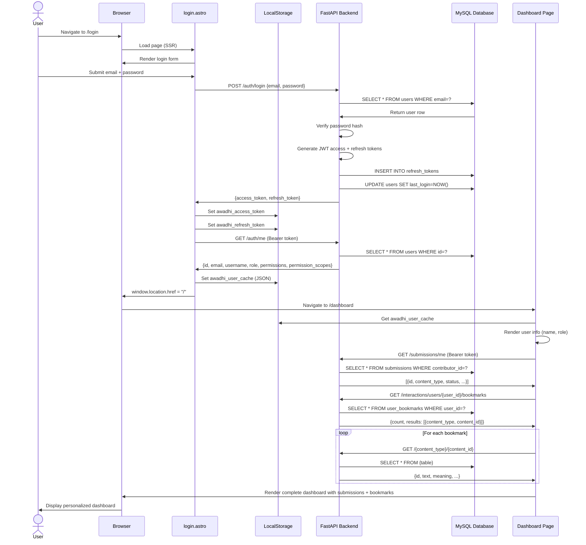

# System Architecture Blueprint: Awadhi New
**Date:** December 30, 2025  
**Version:** 1.0

---

## 1. Mermaid Sequence Diagram: User Login → Dashboard Render



---

## 2. Truth-to-Glass Data Pipeline

### The Journey of a Doha from Database to Screen

```
┌─────────────────────────────────────────────────────────────┐
│ LAYER 1: DATABASE (The Truth)                              │
└─────────────────────────────────────────────────────────────┘
   MySQL Table: doha_entries
   ├─ id: 42
   ├─ main_text: "जो सुख होइ जोग सो, सो सुख पावत आज"
   ├─ meaning: "Whatever happiness is destined, that is received today"
   ├─ text_devanagari: "जो सुख होइ जोग सो, सो सुख पावत आज"
   ├─ text_romanized: "Jo sukh hoi jog so, so sukh paavat aaj"
   ├─ hierarchy_path: "/tulsidas/ramcharitmanas/ayodhyakand"
   ├─ author_id: 5
   ├─ work_id: 12
   ├─ chapter_id: 89
   ├─ created_at: 2024-11-15T10:30:00Z
   ├─ updated_at: 2024-12-01T14:22:00Z
   ├─ version: 2
   ├─ is_canonical: true
   └─ confidence_level: 95

         ↓

┌─────────────────────────────────────────────────────────────┐
│ LAYER 2: ORM MODEL (SQLAlchemy)                            │
└─────────────────────────────────────────────────────────────┘
   Python Object: DohaEntry instance
   doha = db.query(DohaEntry).filter(DohaEntry.id == 42).first()
   
   All fields mapped 1:1 to database columns
   Relationships loaded: doha.author, doha.work, doha.chapter

         ↓

┌─────────────────────────────────────────────────────────────┐
│ LAYER 3: PYDANTIC RESPONSE MODEL                           │
└─────────────────────────────────────────────────────────────┘
   Class: DohaOut (content.py)
   
   ⚠️ TRANSFORMATION OCCURS HERE:
   - created_at, updated_at → DROPPED (not in schema)
   - engagement_kpi relationship → NOT LOADED
   - author/work/chapter names → NOT INCLUDED
   
   Output Fields:
   ✅ id, main_text, meaning, text_devanagari, text_romanized
   ✅ hierarchy_path, version, is_canonical, confidence_level
   ❌ created_at, updated_at (LOST)
   ❌ likes_count, views_count, shares_count (NEVER LOADED)
   ❌ author_name, work_name, chapter_name (NEED JOINS)

         ↓

┌─────────────────────────────────────────────────────────────┐
│ LAYER 4: JSON HTTP RESPONSE                                │
└─────────────────────────────────────────────────────────────┘
   FastAPI → Pydantic serialization
   
   Response: 200 OK
   Content-Type: application/json
   
   {
     "id": 42,
     "main_text": "जो सुख होइ जोग सो, सो सुख पावत आज",
     "meaning": "Whatever happiness is destined...",
     "text_devanagari": "जो सुख होइ जोग सो...",
     "text_romanized": "Jo sukh hoi jog so...",
     "hierarchy_path": "/tulsidas/ramcharitmanas/ayodhyakand",
     "author_id": 5,
     "work_id": 12,
     "chapter_id": 89,
     "version": 2,
     "is_canonical": true,
     "confidence_level": 95,
     "status": "active",
     "visibility": "public",
     "number_in_chapter": 15
   }

         ↓

┌─────────────────────────────────────────────────────────────┐
│ LAYER 5: FRONTEND API CLIENT (api.ts)                      │
└─────────────────────────────────────────────────────────────┘
   JavaScript fetch() → JSON.parse()
   
   No transformation, pure passthrough
   Stored in component state as doha object

         ↓

┌─────────────────────────────────────────────────────────────┐
│ LAYER 6: ASTRO COMPONENT (doha/[id].astro)                 │
└─────────────────────────────────────────────────────────────┘
   Server-Side Rendering (SSR)
   
   const doha = await api(`/content/doha/${id}`);
   
   ⚠️ TRANSFORMATION #2:
   - doha.author_id → NOT RESOLVED to author name
   - doha.hierarchy_path → DISPLAYED as-is (ugly)
   - InteractionBar gets likes={0} because backend never sent counts

         ↓

┌─────────────────────────────────────────────────────────────┐
│ LAYER 7: HTML GENERATION (SSR)                             │
└─────────────────────────────────────────────────────────────┘
   Astro compiles to HTML
   
   <h1 class="text-3xl">
     जो सुख होइ जोग सो, सो सुख पावत आज
   </h1>
   <p class="text-lg">
     Whatever happiness is destined...
   </p>
   
   <!-- SEO Meta Tags -->
   <meta property="og:title" content="जो सुख होइ जोग सो... · Awadhi New" />
   <meta property="og:description" content="Whatever happiness..." />
   
   <!-- JSON-LD Structured Data -->
   <script type="application/ld+json">
   {
     "@context": "https://schema.org",
     "@type": "CreativeWork",
     "name": "जो सुख होइ जोग सो...",
     "description": "Whatever happiness is destined...",
     "inLanguage": "awa"
   }
   </script>

         ↓

┌─────────────────────────────────────────────────────────────┐
│ LAYER 8: BROWSER RENDERING (The Glass)                     │
└─────────────────────────────────────────────────────────────┘
   User sees:
   - Doha text in large font
   - Meaning below
   - InteractionBar with 0 likes (❌ WRONG DATA)
   - No creation date (❌ DATA LOST)
   - No author name (❌ NEEDS RESOLUTION)
```

### Data Losses Identified

| Layer Transition | Data Lost | Reason | Impact |
|------------------|-----------|--------|---------|
| DB → Pydantic | `created_at`, `updated_at` | Not in DohaOut schema | Timestamps never reach frontend |
| DB → Pydantic | Engagement KPIs | No JOIN, no relationship load | Likes/views always 0 |
| Backend → Frontend | Author/Work names | Only IDs sent, no names | Need separate API calls |
| Frontend → User | Hierarchy path | Not parsed/formatted | Shows "/tulsidas/..." instead of "Tulsidas → Ramcharitmanas" |

---

## 3. Scope Matrix: Role-Based Access Control

### Frontend Routes & Component Access

| Route/Component | Public | Registered | Contributor | Moderator | Admin | Notes |
|-----------------|:------:|:----------:|:-----------:|:---------:|:-----:|-------|
| **PUBLIC ROUTES** |
| `/` (Homepage) | ✅ | ✅ | ✅ | ✅ | ✅ | Always accessible |
| `/doha` | ✅ | ✅ | ✅ | ✅ | ✅ | List view |
| `/doha/{id}` | ✅ | ✅ | ✅ | ✅ | ✅ | Detail view |
| `/dictionary` | ✅ | ✅ | ✅ | ✅ | ✅ | List view |
| `/dictionary/{id}` | ✅ | ✅ | ✅ | ✅ | ✅ | Detail view |
| `/idioms` | ✅ | ✅ | ✅ | ✅ | ✅ | List view |
| `/idioms/{id}` | ✅ | ✅ | ✅ | ✅ | ✅ | Detail view |
| `/articles` | ✅ | ✅ | ✅ | ✅ | ✅ | List view |
| `/articles/{id}` | ✅ | ✅ | ✅ | ✅ | ✅ | Detail view |
| `/authors` | ✅ | ✅ | ✅ | ✅ | ✅ | List authors |
| `/authors/{slug}` | ✅ | ✅ | ✅ | ✅ | ✅ | Author detail |
| `/search` | ✅ | ✅ | ✅ | ✅ | ✅ | Global search |
| **AUTH ROUTES** |
| `/login` | ✅ | ❌* | ❌* | ❌* | ❌* | *Redirects if logged in |
| `/register` | ✅ | ❌* | ❌* | ❌* | ❌* | *Redirects if logged in |
| **USER ROUTES** |
| `/dashboard` | ❌ | ✅ | ✅ | ✅ | ✅ | Personal dashboard |
| `/me` | ❌ | ✅ | ✅ | ✅ | ✅ | Profile view |
| `/me/edit` | ❌ | ✅ | ✅ | ✅ | ✅ | Edit profile |
| **SUBMISSION ROUTES** |
| `/submit` | ❌ | ✅ | ✅ | ✅ | ✅ | Create submission |
| `/submissions` | ❌ | ✅ | ✅ | ✅ | ✅ | My submissions |
| `/submissions/{id}` | ❌ | ✅ | ✅ | ✅ | ✅ | Edit own submission |
| **MODERATION ROUTES** |
| `/moderation` | ❌ | ❌ | ❌ | ✅ | ✅ | Queue dashboard |
| `/moderation/queue` | ❌ | ❌ | ❌ | ✅ | ✅ | Full queue |
| `/moderation/queue/{id}` | ❌ | ❌ | ❌ | ✅ | ✅ | Review submission |
| **ADMIN ROUTES** |
| `/admin` | ❌ | ❌ | ❌ | ❌ | ✅ | Admin dashboard |
| `/admin/users` | ❌ | ❌ | ❌ | ❌ | ✅ | User management |
| `/admin/settings` | ❌ | ❌ | ❌ | ❌ | ✅ | System settings |
| `/admin/audit` | ❌ | ❌ | ❌ | ❌ | ✅ | Audit logs |
| `/admin/hierarchy` | ❌ | ❌ | ❌ | ❌ | ✅ | Author/Work/Chapter mgmt |
| `/admin/analytics` | ❌ | ❌ | ❌ | ❌ | ✅ | Analytics dashboard |

### Component-Level Access Control

| Component | Conditional Rendering | Auth Check Location |
|-----------|----------------------|---------------------|
| `InteractionBar.svelte` | Like/Bookmark buttons hidden if not logged in | Client-side: `isLoggedIn()` |
| `SubmissionForm.svelte` | Entire component | Route-level: `/submit` requires auth |
| `ModerationQueue.svelte` | Entire component | Route-level + `AuthGuard.astro` |
| `UsersTable.svelte` | Entire component | `/admin/users` protected |
| `HierarchyEditor.svelte` | Create/Edit buttons | Role check: admin only |
| `AuthStatus.svelte` | Shows different UI per role | Client-side: `user.role` |

### API Endpoint Access

| Endpoint | Public | Registered | Contributor | Moderator | Admin | Backend Enforcement |
|----------|:------:|:----------:|:-----------:|:---------:|:-----:|---------------------|
| `GET /content/doha` | ✅ | ✅ | ✅ | ✅ | ✅ | No auth required |
| `GET /submissions/me` | ❌ | ✅ | ✅ | ✅ | ✅ | `Depends(get_current_user)` |
| `POST /interactions/toggle` | ❌ | ✅ | ✅ | ✅ | ✅ | `Depends(get_current_user)` |
| `GET /moderation/queue` | ❌ | ❌ | ❌ | ✅ | ✅ | `Depends(require_role(Role.MODERATOR))` |
| `POST /admin/users` | ❌ | ❌ | ❌ | ❌ | ✅ | `Depends(require_role(Role.ADMIN))` |

---

## 4. Data Utilization Analysis

### Backend Fields vs Frontend Usage

#### DohaEntry Model (Backend sends 20 fields)

| Field | Backend Sends | Frontend Uses | Status |
|-------|:-------------:|:-------------:|:------:|
| `id` | ✅ | ✅ | ✅ USED |
| `main_text` | ✅ | ✅ | ✅ USED |
| `meaning` | ✅ | ✅ | ✅ USED |
| `text_devanagari` | ✅ | ✅ | ✅ USED (when available) |
| `text_romanized` | ✅ | ✅ | ✅ USED (when available) |
| `hierarchy_path` | ✅ | ⚠️ | ⚠️ USED but not parsed |
| `version` | ✅ | ✅ | ✅ USED in ModerationInfo |
| `is_canonical` | ✅ | ✅ | ✅ USED in TrustSignals |
| `confidence_level` | ✅ | ✅ | ✅ USED in TrustSignals |
| `author_id` | ✅ | ❌ | ❌ IGNORED (need name) |
| `work_id` | ✅ | ❌ | ❌ IGNORED |
| `chapter_id` | ✅ | ❌ | ❌ IGNORED |
| `number_in_chapter` | ✅ | ❌ | ❌ IGNORED |
| `status` | ✅ | ❌ | ❌ IGNORED |
| `visibility` | ✅ | ❌ | ❌ IGNORED |
| `created_at` | ❌ | ❓ | ❌ BACKEND DOESN'T SEND |
| `updated_at` | ❌ | ❓ | ❌ BACKEND DOESN'T SEND |
| `likes_count` | ❌ | ❓ | ❌ BACKEND DOESN'T SEND |
| `views_count` | ❌ | ❓ | ❌ BACKEND DOESN'T SEND |
| `shares_count` | ❌ | ❓ | ❌ BACKEND DOESN'T SEND |

**Utilization Rate: 45% (9/20 fields actively used)**

---

## 5. Critical Gaps Summary

### Missing Backend Data (needs Pydantic model updates)
1. Timestamps (`created_at`, `updated_at`) not in response schemas
2. Engagement metrics never joined/returned
3. Author/Work/Chapter names not included (only IDs)

### Missing Frontend Logic (needs component updates)
1. No hierarchy_path parser (shows raw "/tulsidas/..." instead of breadcrumbs)
2. No loading skeletons on content pages
3. No empty state handling
4. InteractionBar always shows 0 because backend never sends counts

### Security Gaps
1. Frontend doesn't use `permissions` and `permission_scopes` from `/auth/me`
2. No rate limit feedback UI (backend has limits, frontend blind)
3. OAuth callback handler completely missing

---

**Next Step:** Begin implementing fixes based on priority (loading states, engagement data, OAuth).
